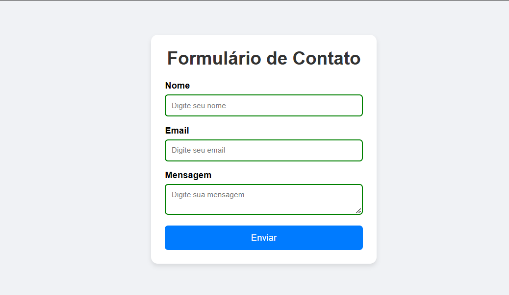
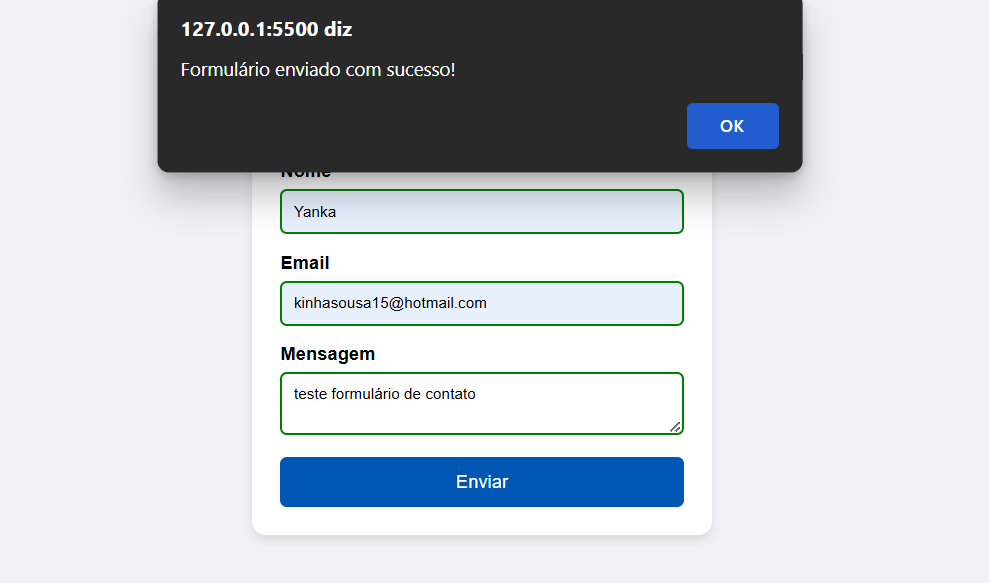

Este projeto é um formulário de contato responsivo com validação em JavaScript, desenvolvido para demonstrar habilidades em HTML, CSS e JavaScript.
🔹 Funcionalidades principais:
Campos de nome, email e mensagem;
Validação em tempo real, destacando erros de preenchimento;
Mensagens de erro personalizadas para cada campo;
Borda vermelha para campos inválidos e verde para campos válidos;
Alerta de sucesso quando todos os dados estão corretos;
Layout responsivo e estilizado com CSS moderno.
🔹 Objetivo:
Praticar a criação de formulários interativos e intuitivos, mostrando no portfólio a capacidade de aplicar boas práticas de usabilidade e validação de dados no front-end.

📌 Project Description – Contact Form with Validation
This project is a responsive contact form with JavaScript validation, developed to demonstrate skills in HTML, CSS, and JavaScript.
🔹 Key Features:
Fields for name, email, and message;
Real-time validation, highlighting input errors;
Customized error messages for each field;
Red border for invalid fields and green border for valid fields;
Success alert when all data is correctly filled;
Responsive layout styled with modern CSS.
🔹 Purpose:
To practice building interactive and user-friendly forms, showcasing the ability to apply best practices in usability and data validation on the front end.

## 🖼️ Demonstração

### Tela inicial

### Formulário enviado com sucesso

